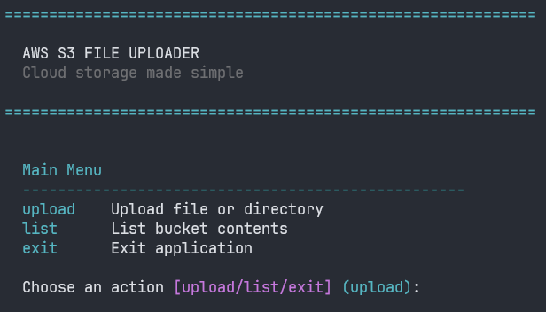

# AWS S3 File Uploader

A Python CLI application for uploading files to AWS S3 with an interactive GUI file picker, progress tracking, and rich terminal interface.

## Features

- 🎯 **Interactive GUI File Picker** - Easy single file selection using `textual-fspicker`
- 📊 **Progress Tracking** - Real-time upload progress with speed and ETA
- 🔒 **Secure** - Uses environment variables for AWS credentials
- 🎨 **Rich CLI Interface** - Beautiful terminal UI with `rich`
- ⚡ **Multipart Upload** - Efficient handling of large files (25MB+ chunks)
- 📋 **List Bucket Contents** - View files in your S3 bucket with filtering by prefix
- 📁 **Folder Selection** - Automatically organizes uploads into predefined folders in `vpms-vrt-emea-exp/`

## Requirements

- Python 3.13+
- AWS Account with S3 access
- AWS credentials configured

## Installation

1. Clone the repository:

```bash
git clone https://github.com/yourusername/s3-uploader.git
cd s3-uploader
```

2. Install dependencies using `uv`:

```bash
uv sync
```

3. Create a `.env` file with your AWS credentials:

```
AWS_S3_BUCKET_NAME=your-bucket-name
AWS_REGION=eu-central-1
AWS_ACCESS_KEY_ID=your-access-key
AWS_SECRET_ACCESS_KEY=your-secret-key
```

## Usage

### Basic Usage

Run the application:

```bash
uv run main.py
```



### Main Menu Options

The application provides two main operations:

1. **Upload File** - Select and upload a single file to S3
2. **List Bucket Contents** - View files in your S3 bucket with optional prefix filtering

### Uploading a File

When you choose to upload a file:

- A GUI file picker will open to select your file
- Choose from 5 predefined folders:
  - **content/** - Main content files
  - **logo/** - Logo and branding files  
  - **stills/** - Still images and screenshots
  - **subtitles-closed/** - Closed caption files
  - **subtitles-open/** - Open subtitle files
- Optionally customize the filename in S3
- Watch the progress bar as your file uploads with real-time speed and ETA

All uploads are automatically organized under the `vpms-vrt-emea-exp/` prefix in your S3 bucket.

### Listing Bucket Contents

When you choose to list bucket contents:

- Enter a prefix to filter (defaults to `vpms-vrt-emea-exp/`)
- View up to 100 files with their sizes

## Configuration

### Environment Variables

| Variable | Required | Default | Description |
|----------|----------|---------|-------------|
| `AWS_S3_BUCKET_NAME` | Yes | - | Your S3 bucket name |
| `AWS_REGION` | No | `us-east-1` | AWS region |
| `AWS_ACCESS_KEY_ID` | No | - | AWS access key (uses default credentials if not set) |
| `AWS_SECRET_ACCESS_KEY` | No | - | AWS secret key |

### AWS Credentials

The application supports standard AWS authentication methods:

1. Environment variables (via `.env` file)
2. AWS credentials file (`~/.aws/credentials`)
3. IAM role credentials (when running on AWS services)

## Project Structure

```
s3-uploader/
├── main.py              # Main application entry point
├── file_picker.py       # GUI file picker using Textual
├── file_uploader.py     # S3 upload logic and utilities
├── pyproject.toml       # Project dependencies
└── README.md            # This file
```

## Dependencies

- **boto3** - AWS SDK for Python
- **python-dotenv** - Environment variable management
- **rich** - Terminal formatting and progress bars
- **textual-fspicker** - GUI file picker widget
